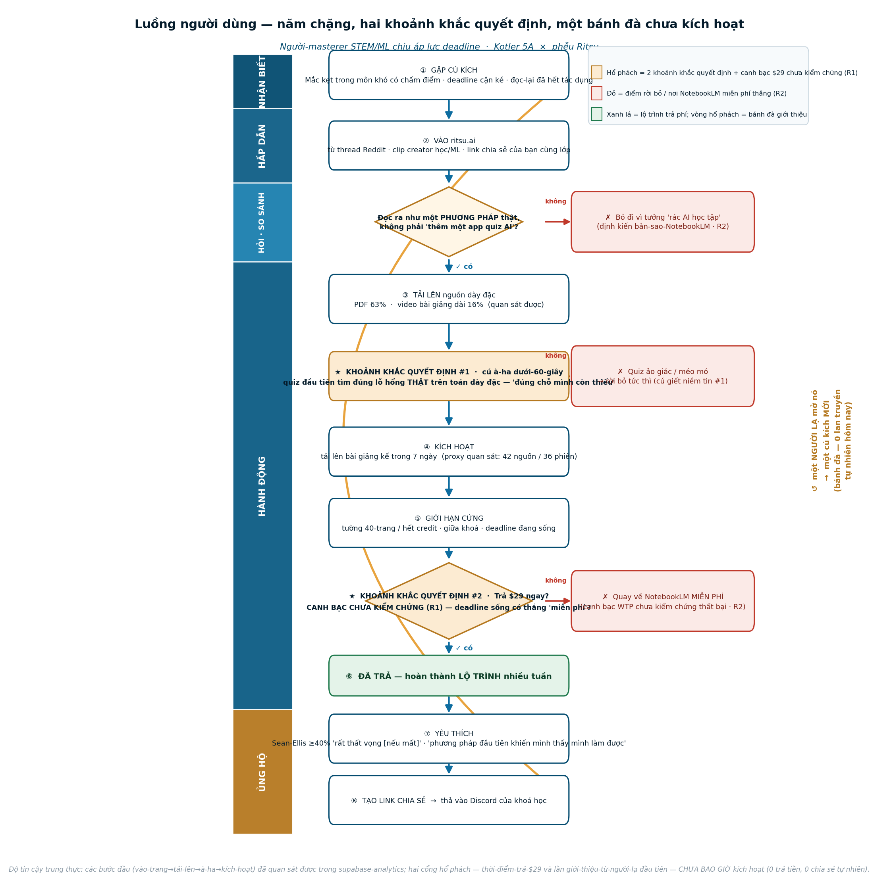

# Hành Trình Khách Hàng — Người Làm Chủ STEM/ML Chịu Áp Lực Deadline

> Toàn bộ hành trình Kotler **5A** (Aware → Appeal → Ask → Act → Advocacy) ánh xạ lên **phễu thật** của Ritsu (thấy-yếu-tố-kích-hoạt → vào trang → đăng ký → tải tài liệu → cú à-ha dưới-60-giây → kích hoạt → free→paid → yêu thích → giới thiệu), cho đúng wedge (phân khúc nêm) 100 khách đầu tiên đã chốt. Xây theo run `/think mckinsey` `ritsu-segment-persona-journey-v1`. Tài liệu đồng hành với `persona-portrait.md`.
>
> **Độ tin cậy được trình bày trung thực:** ở true-zero (điểm-không thật sự), phần lớn nội dung này là `hypothesis`/`inferred`. Những thẻ được đánh dấu `observed` có căn cứ từ tín hiệu Door-2 của `supabase-analytics` (756 sources · 656 sessions · 15 link chia sẻ chỉ-của-founder · 0 khách trả tiền thật).

## 0. Toàn cảnh hành trình — 5A × phễu × cảm xúc

| 5A stage | Bước phễu Ritsu | Cung bậc cảm xúc | Khoảnh khắc quyết định | KPI giai đoạn |
|---|---|---|---|---|
| **NHẬN BIẾT (Aware)** | thấy-yếu-tố-kích-hoạt → vào trang ritsu.ai | lo sợ/tụt lại → *nhận ra* ("là phương pháp sai, không phải tại tôi") | 3–5 giây đầu: đọc ra như **một phương pháp để làm chủ một môn khó**, không phải "thêm một món đồ chơi quiz AI" | số phiên vào trang đủ điều kiện từ các bề mặt wedge |
| **HẤP DẪN (Appeal)** | vào trang → hình thành cảm giác "ồ, mình thích cái này" → ý-định-đăng-ký | hoài nghi/thủ thế → tò mò dè dặt | thả-file → 30 giây → quiz từ tài liệu **CỦA TÔI**, **đáng tin trên STEM dày đặc** | tỷ lệ vào trang → ý-định-đăng-ký |
| **HỎI/SO SÁNH (Ask)** | nghiên cứu/so sánh → ĐĂNG KÝ | hoài nghi/lo lắng → nhẹ nhõm *hoặc* hoài nghi được xác nhận | cuộc **đối đầu trực diện**: cùng một PDF bài giảng trong Ritsu vs NotebookLM — bên nào bắt được lỗ hổng **của tôi** + trích dẫn đúng slide | tỷ lệ nghiên cứu → đăng ký |
| **HÀNH ĐỘNG (Act)** | đăng ký → tải tài liệu → **cú à-ha dưới-60-giây** → kích hoạt → chạm giới hạn cứng → **FREE→PAID** | lo lắng/tự nghi ngờ → nhẹ nhõm/làm chủ → căng thẳng cân-đo chi-phí-lợi-ích | **HAI**: (1) cú à-ha dưới-60-giây trên toán dày đặc; (2) **thời-điểm-trả-$29** ở giới hạn đầu tiên, deadline đang treo | **free→paid ở giới hạn cứng đầu tiên** |
| **ỦNG HỘ (Advocacy)** | làm chủ bền vững → **YÊU THÍCH** → link chia sẻ → quay vòng về A1 | tự hào/nhẹ nhõm → thuộc về/truyền giáo | một **người lạ bấm vào link chia sẻ** và thấy **LỘ TRÌNH nhiều-tuần**, không phải bức tường trả phí hay một quiz mỏng | **lượt đăng ký từ giới thiệu-người-lạ tự nhiên (hiện 0)** |

**Hai rủi ro xuyên suốt cả hành trình:** (1) **rủi ro bị-nhìn-nhận-như-NotebookLM** cắn ở NHẬN BIẾT/HẤP DẪN/HỎI/ỦNG HỘ (Ritsu phải *hiện rõ* là LỘ TRÌNH nhiều-tuần + theo dõi-sự-làm-chủ, cái xương sống mà NotebookLM miễn phí thiếu — không bao giờ là "chúng tôi cũng làm quiz"); (2) **canh bạc WTP chưa được chứng minh** dồn vào thời-điểm-trả-tiền ở HÀNH ĐỘNG (liệu một deadline đang treo có khiến họ trả $29 thay vì xài-chùa NotebookLM không — chính là điều mà cuộc quan sát N=10 phải kiểm chứng).

---

## Toàn cảnh luồng người dùng (sơ đồ luồng người dùng)

Đọc từ trên xuống. **Cột bên trái** là 5A của Kotler (Aware → Appeal → Ask → Act → Advocacy); **cột giữa** là phễu sản phẩm thật của Ritsu. Điều mà sơ đồ làm rõ không thể bỏ qua là *nơi sự chắc chắn kết thúc*. Mọi bước từ **vào trang đến kích hoạt đều là quan sát được** trong analytics — những người tải tài liệu tiếp tục tạo nội dung (3.329 learning-units từ 756 sources) và họ quay lại — nhưng sau đó phễu thắt lại vào **hai cổng màu hổ phách chưa từng một lần kích hoạt**. Cổng thứ nhất là **cú à-ha dưới-60-giây trên toán dày đặc**: nếu quiz trên một PDF backprop ở mức tầm thường, niềm tin của người học hoài nghi này vỡ ngay lập tức, và đây cũng là hào nước chính chống lại NotebookLM *miễn phí*. Cổng thứ hai là **thời-điểm-trả-$29** ở giới hạn cứng đầu tiên với deadline đang treo — chính là canh bạc chưa-chứng-minh duy nhất (**R1**) mà cuộc quan sát N=10 tồn tại để giải quyết. **Các nhánh đỏ** là nơi một người học từng-bị-thất-vọng rời đi, và ở hầu hết các nhánh đó lối thoát là **NotebookLM miễn phí** (**R2**). Cuối cùng, **vòng lặp màu hổ phách** là bánh đà giới thiệu: đã được dựng về mặt cơ chế (15 link chia sẻ) nhưng **0 tự nhiên** — mọi lượt chia sẻ đến giờ đều là của founder. Toàn bộ công việc của người vận hành, gói trong một bức tranh, là **kỹ thuật hóa hai cổng hổ phách và nhen lửa vòng lặp đó**.

---

## 1. A1 · NHẬN BIẾT (Aware)

**Tường thuật giai đoạn:** Đang là tuần 3 của cs231n (hoặc 6.S191, hoặc một môn lý thuyết ML cao học) và lỗ hổng vừa hiện ra: bài tập yêu cầu họ suy ra backprop qua một lớp batchnorm, slide bài giảng mặc định rằng họ đã thấm Jacobian rồi, và xem lại bản ghi đến lần thứ ba cũng chẳng tạo ra hiểu biết mới nào. Họ cảm thấy nỗi lo sợ rất cụ thể của một người nghiêm túc, học *cật lực* mà vẫn thấy tụt lại — cái giọng nói "mình không đủ thông minh cho cái này" — trong khi một bài kiểm tra giữa kỳ có điểm đang chờ N tuần nữa trên đề cương. Khuya đêm họ ngừng đọc-lại và bắt đầu *tìm kiếm*: "làm sao để thực sự hiểu backpropagation," "cs231n assignment 1 quá khó," "cách tốt nhất để học các paper ML dày đặc." Họ không tìm một chatbot làm hộ; họ muốn một *phương pháp* khiến bài tập kế tiếp khả thi, và thứ đầu tiên gọi tên *đúng* vấn đề của họ — "đọc-lại là thụ động, đó là lý do nó không thấm" — sẽ giành được cú click.

| Khía cạnh | Persona này ở NHẬN BIẾT | Conf | Source |
|---|---|---|---|
| Kích hoạt / điểm vào | Một bức tường cụ thể trong một môn dày đặc có chấm điểm: một bài tập họ không thể bắt đầu, một bài giảng/paper đã xem lại 2–3× mà không tiến bộ, một bài giữa kỳ ấn định N tuần nữa. Kích hoạt cảm nhận = "đọc-lại đã ngừng hiệu quả và deadline là thật." | inferred | Kotler 5A + wedge; PDF 63% + YouTube 16% (observed) = tài liệu bài-giảng-PDF + bài-giảng-ghi-hình |
| Cảm xúc (trước → sau) | Trước: lo lắng, tụt lại, xấu hổ thầm lặng ("ai cũng hiểu được mà"), hoảng-loạn-về-thời-gian. Sau ấn tượng đầu tiên: nhẹ nhõm + nhận ra — "là phương pháp sai, không phải tại tôi." | hypothesis | niềm-tin-sai-lầm của wedge; cảm xúc chưa kiểm chứng ở true-zero |
| Kênh / điểm chạm | Reddit (r/learnmachinelearning, r/cs231n, r/MachineLearning, r/GradSchool); Google đuôi-dài; YouTube (Justin Sung, Ali Abdaal, lân cận 3Blue1Brown); X/#studytwt; các Discord OCW (fast.ai, DeepLearning.AI). Khám phá = lực-kéo-từ-tìm-kiếm-và-cộng-đồng, không phải đẩy-trả-phí. | inferred | các kênh trong charter; dị ứng chiêu trò → tin qua cộng đồng |
| Thông điệp hiệu quả | Gọi tên nỗi đau, rồi đến cơ chế: "Đọc-lại có cảm giác hiệu quả mà không hề. Active recall (chủ động gợi nhớ) + một lộ trình nhiều-tuần có cấu trúc thắng việc xem lại bài giảng cs231n số 4 lần thứ tư." Cho thấy *artifact* (lỗ hổng concept-map thật + quiz đầu tiên từ một PDF ML). Không bao giờ "AI làm bài tập hộ bạn." | inferred | niềm tin "làm chủ chủ động, có AI làm đòn bẩy" |
| Bước phễu Ritsu | thấy-yếu-tố-kích-hoạt → vào trang ritsu.ai (trước-đăng-ký; mục tiêu = một cú click đủ điều kiện). | given | định nghĩa phễu |
| Khoảnh khắc quyết định | 3–5 giây ở lần tiếp xúc đầu: Ritsu đọc ra là "một *phương pháp* để làm chủ một môn khó" hay "thêm một món đồ chơi flashcard AI" (nhận-thức-bản-sao-NotebookLM)? | inferred | Risk #2 |
| Rơi rụng / ma sát | (1) bị quy về loại nội-dung-rác-học-bằng-AI; (2) đọc ra như một app nhồi-nhét/flashcard một-phát; (3) giọng-quảng-cáo trong một cộng đồng trừng phạt điều đó; (4) "AI làm hộ bạn" đẩy lùi người-học-sắc-bén-không-phải-lười. | inferred | tâm lý wedge + Risk #2 |
| Vi-chuyển-đổi | Cú click đủ điều kiện vào ritsu.ai với chủ ý ("cái này có thể được xây cho *môn của mình*"), trước khi có bất kỳ tài khoản nào. | inferred | phễu trước-đăng-ký |
| Đòn bẩy | Giành uy-tín-phương-pháp ở yếu-tố-kích-hoạt, cụ-thể-theo-môn-học: gieo những câu trả lời thực sự hữu ích trong r/learnmachinelearning / r/cs231n / Discord fast.ai (giúp trước, link sau); xuất bản bằng-chứng-đặt-tên-theo-đầu-cầu ("Làm chủ cs231n trong N tuần: lộ trình active-recall" dạng Shorts kèm một lỗ hổng concept-map thật); đồng-bảo-chứng với một nhà sáng tạo nội dung về khoa-học-học-tập (Justin Sung); hero trang đích nói đúng giọng người-làm-chủ ML chịu áp lực deadline + tạo khác biệt bằng LỘ TRÌNH + 17 hoạt động + theo dõi-sự-làm-chủ. | inferred | các kênh + Risk #2 |
| KPI giai đoạn | Số phiên vào trang đủ điều kiện từ các bề mặt wedge (UTM theo source) × tỷ lệ vào trang→đăng ký của lượng traffic đó. Phụ: lượng tìm kiếm chủ-ý-ML + tìm-kiếm-thương-hiệu; số lượt nhắc tên trong cộng đồng (hiện **0 tự nhiên — observed**). | inferred | observed: 15 lượt chia sẻ đều-của-founder ⇒ nhận biết tự nhiên ≈ 0 hôm nay |

---

## 2. A2 · HẤP DẪN (Appeal)

**Tường thuật giai đoạn:** Cô ấy vào ritsu.ai từ một thread Reddit đêm trước kỳ giữa kỳ cs231n, nửa-ngờ-rằng lại là một bản bọc ChatGPT kiểu "dán-ghi-chú-của-bạn-vào." Câu hero — *"Turn Raw Materials Into True Mastery"* — và demo 3-bước cho thấy đúng điều cô muốn: thả một file → 30 giây → một **lộ trình** có cấu trúc, không phải một ô chat. Cô kéo vào PDF backprop của Assignment 2 vốn đang đè bẹp cô, xem nó biến thành một quiz *từ chính tài liệu của cô* + một concept-map làm nổi bật chính xác bước quy-tắc-chuỗi mà cô cứ vấp, và có gì đó dịch chuyển từ hoài nghi sang "khoan — cái này được xây để *học cho hiểu*, không phải làm hộ mình." Cú hook lành đúng *bởi vì* cô không tin chiêu trò: nó hứa làm *cô* sắc bén hơn, không phải làm công việc biến mất. Rủi ro: trang chủ đọc ra như edtech chung chung (một app flashcard) trước khi cô thấy một quiz trên chính tài liệu dày đặc của mình.

| Khía cạnh | Persona này ở HẤP DẪN | Conf | Source |
|---|---|---|---|
| Kích hoạt / điểm vào | Click-through từ một bề mặt chủ-ý-cao với một cái-được-đặt-cược có ngày cụ thể đang treo ("giữa kỳ cs231n thứ Năm, backprop chưa thông"). Ấn tượng đầu = hero + demo 3-bước. | inferred | PDF 63% + YouTube 16% (observed) = tài liệu của cô khớp lời hứa đầu-vào |
| Cảm xúc (trước → sau) | Trước: hoài nghi/thủ thế ("thêm một chiêu AI làm mình lười đi" + "mình không đủ thông minh"). Sau: tò mò dè dặt ("cái này để *làm chủ* nó, và nó đọc được PDF CỦA TÔI"). Niềm tin đến sau, ở cú à-ha. | hypothesis | tâm lý; chưa kiểm chứng |
| Kênh / điểm chạm | trang đích ritsu.ai (hero + 3-bước-có-hoạt-ảnh + các ô workflow: "Làm chủ một chương sách giáo khoa", "Vượt kỳ thi trong 3 ngày", "Bóc tách một paper nghiên cứu"). Các ô "thi trong 3 ngày" + "paper nghiên cứu" là tấm gương tự-nhận-ra của cô. | inferred | các workflow trang chủ trong product.md |
| Thông điệp hiệu quả | "Một lộ trình nhiều-tuần có cấu trúc + 17 cách luyện tập từ TÀI LIỆU CỦA BẠN — để bạn thực sự làm chủ nó, chứ không chỉ đọc-lại." Điểm khác biệt: **làm chủ + theo dõi, không phải đáp án**. Câu chống-chiêu-trò ("AI là đòn bẩy, không phải vật thay thế") vô hiệu hóa phản đối số 1 của cô. Cho xem một vòng lặp 10 giây của một PDF cs231n/backprop thật → quiz + concept-map lỗ hổng. | inferred | niềm tin trong positioning.md; product.md §5 |
| Bước phễu Ritsu | vào trang → "ồ, mình thích cái này" → bấm một ô workflow → tới CTA ĐĂNG KÝ. Kết thúc ở "mình sẽ thử cái này với file của mình." | inferred | phễu |
| Khoảnh khắc quyết định | Lời tuyên bố thả-file → 30 giây → quiz-từ-tài-liệu-CỦA-TÔI ghi nhận được là đáng tin + *cụ thể cho STEM dày đặc* (phương trình, code, một hình ML thật), để một người-học-mắc-kẹt-ở-backprop tin rằng nó hiệu quả trên tài liệu khó nhất của cô. | inferred | cú hook; tài liệu của cô nặng phương-trình/code |
| Rơi rụng / ma sát | (1) hero đọc ra như app flashcard/ghi-chú → bị bỏ qua vì thấp-stakes; (2) demo chỉ cho thấy văn xuôi dễ → cô nghi nó không phân tích được LaTeX/sơ đồ/code → mặc định nó bịa; (3) "AI tutor" → "mình có ChatGPT miễn phí rồi"; (4) không có bằng chứng về LỘ TRÌNH nhiều-tuần/theo dõi → trông y hệt NotebookLM miễn phí. | hypothesis | độ tin cậy = thanh SERVQUAL #1; Risk #2 |
| Vi-chuyển-đổi | "Mình sẽ tải file thật của mình lên để xem quiz" — bấm tải lên với chủ ý dùng tài liệu CỦA CÔ. Phụ: bấm ô "thi trong 3 ngày" / "paper nghiên cứu" (tự-định-danh). | inferred | bắc cầu sang HÀNH ĐỘNG |
| Đòn bẩy | Đặt một **bằng chứng STEM chịu áp lực deadline lên hero**: mặc định demo về một artifact khó dễ-nhận-ra (cs231n/backprop hoặc một trang paper ML thật kèm phương trình + code) → cho thấy quiz + concept-map lỗ hổng + một thoáng nhìn lộ trình nhiều-tuần & heatmap sự-làm-chủ trong cùng một khung. Dẫn dắt bằng "làm chủ, không phải đáp án" + câu chống-lười-biếng. Thêm một biến thể trang đích khớp-wedge cho traffic ML/OCW. Đặt Ritsu vượt vị thế NotebookLM (lộ trình + theo dõi + 17 hoạt động) và ChatGPT (đọc toàn-bộ-tài-liệu, bền-vững-qua-phiên, có cấu trúc) ngay trong màn cuộn đầu tiên. | inferred | các POD trong positioning.md; product.md §9 |
| KPI giai đoạn | Tỷ lệ vào trang → ý-định-đăng-ký cho traffic nguồn-từ-wedge (% người bấm CTA chính / bắt đầu một lượt tải lên). Đại lượng đại diện: mức tương tác với hero-demo; CTR ô-workflow trên "thi trong 3 ngày" + "paper nghiên cứu"; CVR vào trang→đăng ký theo source. | inferred | chưa có baseline observed (true-zero) |

---

## 3. A3 · HỎI/SO SÁNH (Ask)

**Tường thuật giai đoạn:** Đang là tuần 2 của cs231n và phép suy ra gradient-của-softmax trong ghi chú bài giảng không vào — người học này đã đốt cả một buổi tối đọc-lại nó và giờ, lúc 11 giờ đêm, đang làm điều họ luôn làm trước khi cam kết với BẤT KỲ công cụ nào: mở một tab mới và gõ "NotebookLM vs Ritsu" và "AI tốt nhất để học từ lecture pdf reddit." Họ không lướt cho vui; họ đang chạy một cuộc đánh giá có chủ đích, hoài nghi, vì họ đã từng-bị-thất-vọng bởi một "AI học tập" tự tin tạo ra một flashcard sai — và họ KHÔNG để một quiz bịa làm hỏng hiểu biết của mình ba ngày trước kỳ giữa kỳ. Câu hỏi áp đảo là **"nó có nói dối mình không?"** — độ chính xác trước tiên, rồi đến "nó có thực sự miễn phí không," rồi "đây chỉ là ChatGPT-kèm-PDF hay một lộ trình nhiều-tuần thật." Họ tin một bạn cùng môn trong Discord của lớp hơn nhiều so với bất kỳ lời quảng cáo nào trên trang đích, và sẽ chạy một cuộc đối đầu trực diện theo nghĩa đen: cùng một PDF bài giảng đưa vào Ritsu VÀ NotebookLM, rồi phán xét quiz nào bắt được khái niệm mà họ thực sự không hiểu.

| Khía cạnh | Persona này ở HỎI/SO SÁNH | Conf | Source |
|---|---|---|---|
| Kích hoạt / điểm vào | Một khái niệm không vào (phép suy ra softmax/backprop) vài ngày trước một kỳ giữa kỳ có chấm điểm + một ký ức mơ hồ "có ai đó đã chia sẻ một công cụ học bằng AI" → chủ đích mở các tab đánh giá trước khi cam kết. | inferred | deadline high-stakes; hành vi nghiên cứu không nằm trong analytics |
| Cảm xúc (trước → sau) | Trước: hoài nghi + lo lắng ("không thể chịu nổi một đáp án sai tuần này") + chai sạn ("AI nào cũng hứa quá lời"). Sau (tốt): nhẹ nhõm dè dặt ("quiz bắt được lỗ hổng của mình và trích dẫn đúng slide"); (xấu): hoài nghi được xác nhận ("biết ngay mà — chiêu trò"). | inferred | tâm lý đã chốt; hóa-trị-cảm-xúc được lập luận |
| Kênh / điểm chạm | Các thread Reddit (r/cs231n, r/learnmachinelearning, r/MachineLearning, r/GradSchool); **Discord/Slack #resources của lớp** (đáng-tin-nhất); các bài review YouTube "NotebookLM for studying"; X/#studytwt; các video "best AI study tools" của Justin Sung / Ali Abdaal; một trang SERP so sánh trên Google. | inferred | YouTube = 16% sources observed ⇒ đúng là một hồ-tụ-nước thật |
| Thông điệp hiệu quả | Một bảng so sánh trung thực "**Ritsu vs NotebookLM vs ChatGPT vs Anki** để học từ một lecture PDF" — trung thực ở chỗ NotebookLM thắng (miễn phí, Google), nêu rõ lợi thế của Ritsu: **LỘ TRÌNH** nhiều-tuần có cấu trúc + 17 hoạt động + **theo dõi sự-làm-chủ xuyên suốt môn học** + mọi đáp án quiz đều **trích dẫn đúng slide/trang nguồn** (chống-bịa-đặt). "Miễn phí mãi mãi, không cần thẻ" nói thẳng. Một ví dụ cs231n/6.S191 đã giải thật. | inferred | positioning §6.7 ưu-tiên-độ-tin-cậy + 2 rủi ro |
| Bước phễu Ritsu | nghiên cứu trước-đăng-ký → vào trang ritsu.ai (hoặc một trang so sánh/blog) → quyết định ĐĂNG KÝ + chạy lượt TẢI LÊN thử đầu tiên. | inferred | bàn giao HỎI→HÀNH ĐỘNG |
| Khoảnh khắc quyết định | **Phép thử quiz đối đầu**: cùng một PDF bài giảng đưa vào Ritsu và NotebookLM; phán xét bên nào (a) chính xác, (b) bắt được khái niệm họ không hiểu, (c) cho thấy một lộ trình thật cho phần còn lại của môn — không chỉ một lượt chat. | inferred | cuộc đánh giá theo nghĩa đen; Risk #2 hiện rõ |
| Rơi rụng / ma sát | (1) không có bằng chứng độ-chính-xác/trích-dẫn đáng tin → "chắc nó bịa"; (2) "17 hoạt động / engine làm chủ" đọc ra như phình-tính-năng-chiêu-trò với một người học nghiêm túc chỉ muốn quiz đúng; (3) NotebookLM miễn phí + được-Google-tin-cậy + đã-biết → quán-tính người-thắng-mặc-định; (4) bức tường đăng ký trước khi có một quiz thật → bỏ đi. | inferred | dị-ứng-chiêu-trò + NotebookLM (rủi ro đã chốt) |
| Vi-chuyển-đổi | "Mình sẽ cứ thử nó trên đúng cái lecture PDF này" — quyết định chạy phép thử (chưa trả tiền). Phụ: lưu/chia sẻ trang so sánh hoặc hỏi Discord của lớp "có ai thử Ritsu chưa?" | inferred | — |
| Đòn bẩy | Giành lý lẽ **độ-chính-xác + lộ trình** *trước* khi đăng ký: (a) xuất bản một trang so sánh "Ritsu vs NotebookLM cho lecture PDFs" + một video review kiểu-Justin-Sung; (b) biến **trích-dẫn-trên-mọi-đáp-án** thành bằng-chứng-niềm-tin tiêu đề; (c) gieo những câu trả lời trung thực trong r/cs231n / các Discord của lớp (nhà-sáng-tạo > giọng-thương-hiệu); (d) cho họ thấy MỘT quiz được tạo thật trên một bài giảng ML đã-biết *mà không* cần đăng ký; (e) khung lại 17 hoạt động thành "một lộ trình có cấu trúc tới kỳ thi cuối," không phải một danh sách tính năng. | inferred | tấn công 2 rủi ro + dùng danh sách kênh |
| KPI giai đoạn | Tỷ lệ nghiên cứu → đăng ký từ các điểm chạm so-sánh/review. Chẩn đoán: lượng tìm-kiếm-so-sánh-thương-hiệu / số lượt nhắc tên trên Reddit-Discord ("có ai thử Ritsu"); tỷ trọng nguồn-đăng-ký từ các kênh nhà-sáng-tạo-học-tập + OCW. | inferred | 0 giới thiệu tự nhiên observed ⇒ khởi đầu ở ~0, chính là thứ cần làm chuyển động |

---

## 4. A4 · HÀNH ĐỘNG (Act)

**Tường thuật giai đoạn:** Đang là thứ Ba, Assignment 2 của cs231n (batchnorm + conv backprop) đến hạn trong 9 ngày và kỳ giữa kỳ tuần kế tiếp; người học đã đọc-lại PDF của bài-giảng-9 ba lần mà vẫn không *làm được* phép suy ra gradient, và cái cảm giác gặm nhấm "mình không đủ thông minh cho cái này" lại quay về. Họ vào ritsu.ai (từ một bình luận Reddit), kéo vào PDF bài giảng 24-trang, và trong chưa đầy một phút nhận được một lộ trình có cấu trúc với một quiz đầu tiên lập tức làm nổi bật đúng cái thứ họ không hiểu — bước quy-tắc-chuỗi qua phép chuẩn hóa — được hiển thị như một lỗ hổng concept-map, không phải một bức tường chữ. Cái "à, *đó* mới là mảnh mình đang thiếu" chính là cú à-ha (đại lượng đại diện observed: 42 sources / 36 sessions duy trì vượt ngoài founder; 3329 units được tạo — người tải tài liệu lên DUY TRÌ việc tạo nội dung). Họ dùng nó cho hết tuần và tải lên bài giảng *kế tiếp* mà không cần nhắc (observed: kiểu revisit 4-sources/10-sessions chính xác là điều này). Rồi giữa-chừng-Assignment-2 họ chạm bức tường credit/trang trên PDF dày đặc kế tiếp, và đối mặt câu hỏi thật, chưa-kiểm-chứng: trả $29 ngay vì deadline còn 6 ngày, hay lê lết trên NotebookLM miễn phí — và liệu *lộ trình* nhiều-tuần + theo dõi-sự-làm-chủ có đáng tiền thật so với một công-cụ-làm-quiz miễn phí hay không là **CANH BẠC của cả wedge** (hypothesis; thanh toán chưa từng observed ở true-zero).

| Khía cạnh | Persona này ở HÀNH ĐỘNG | Conf | Source |
|---|---|---|---|
| Kích hoạt / điểm vào | Một deadline cụ thể + một khoảnh khắc mắc kẹt: cs231n A2 / lab 6.S191 / quiz Andrew Ng đến hạn trong <10 ngày; đã đọc-lại PDF 3× mà vẫn không *làm được* phép suy ra. Kích hoạt hành động = "mình còn N ngày và đang không tiến triển." | inferred | wedge (chịu áp lực deadline); niềm-tin-sai-lầm |
| Cảm xúc (trước → sau) | Trước: lo lắng + tự-nghi-ngờ (nỗi lo deadline). Sau À-HA: nhẹ nhõm + làm chủ ("là phương pháp sai, không phải tại tôi — tôi thấy được đúng lỗ hổng"). Sau khi chạm giới hạn: căng thẳng cân-đo chi-phí-lợi-ích ("đáng $29 với 6 ngày còn lại chứ?"). | inferred / hypothesis | ICP; cảm xúc thời-điểm-trả-tiền chưa kiểm chứng |
| Kênh / điểm chạm | **Ô tải lên** của ritsu.ai là điểm chạm; tài liệu là một PDF ML/STEM dày đặc (observed: PDF 63%) hoặc một link bài-giảng YouTube (observed: 16%). Khoảnh khắc diệu kỳ <60 giây. Không có người, không có bán hàng — sản phẩm CHÍNH LÀ lời chào hàng. | observed (định dạng) / inferred (luồng) | analytics 756 sources |
| Thông điệp hiệu quả | Không phải câu chữ — mà là *quiz đầu tiên tìm ra lỗ hổng*: "Bạn bỏ lỡ bước quy-tắc-chuỗi qua batchnorm — đây là vị trí của nó trong concept map." Khung làm-chủ ("bạn hiểu 4/11 khái niệm trong bài giảng này"), không phải "làm tốt lắm!". Ở giới hạn: "Bạn còn 6 ngày tới deadline và đang giữa-lộ-trình — giữ đà của bạn" >> câu "nâng cấp ngay" chung chung. | inferred / hypothesis | niềm tin = làm chủ chủ động; theo dõi = POD so với NotebookLM |
| Bước phễu Ritsu | ĐĂNG KÝ → lượt TẢI LÊN đầu tiên (PDF dày đặc) → **CÚ À-HA DƯỚI-60-GIÂY** (quiz đầu + concept-map lỗ hổng) → KÍCH HOẠT (dùng nó suốt tuần; tải-lại bài giảng kế tiếp mà không cần nhắc) → GIỚI HẠN cứng (giới hạn free 40-trang / cạn credit giữa-môn) → **FREE→PAID**. | observed (tải lên→duy trì) / hypothesis (trả tiền) | analytics: 42 src/36 sessions; 4 src/10 sessions |
| Khoảnh khắc quyết định | **HAI.** (1) Cú à-ha dưới-60-giây: liệu quiz đầu tiên có tìm được một lỗ hổng *thật* trên toán dày đặc (không tầm-thường/không-sai)? (2) **Thời-điểm-trả-tiền**: ở giới hạn cứng đầu tiên giữa-môn với deadline đang treo — họ gõ một thẻ trả $29, hay rút về NotebookLM miễn phí? Canh bạc #1 = chất lượng sinh nội dung; canh bạc #2 = WTP chưa-chứng-minh. | hypothesis | 2 RỦI RO của wedge |
| Rơi rụng / ma sát | (a) chất lượng sinh nội dung trên toán dày đặc — một quiz LaTeX/backprop méo mó giết niềm tin tức thì; (b) giới hạn free 40-trang/30-phút < một bài giảng 60-trang hoặc video 90-phút → lượt tải lên bị cắt cụt trước cú à-ha; (c) ở bức tường: "NotebookLM miễn phí làm tài-liệu→quiz với $0, sao phải trả $29?"; (d) sốc-giá $29 trên ngân sách sinh viên. | inferred / hypothesis | giá; Risk #2; 0 khách trả tiền observed |
| Vi-chuyển-đổi | Chuỗi những cái-gật-nhỏ: hoàn thành quiz đầu → mở concept-map lỗ hổng → làm một hoạt động thứ 2 → **tải-lại bài giảng kế tiếp mà không cần nhắc** (tín hiệu mạnh nhất trước-paywall — revisit observed) → chạm giới hạn và bấm "xem các gói" thay vì bỏ đi. | observed (tải-lại) / inferred | revisit trong analytics |
| Đòn bẩy | Làm cho cú à-ha dưới-60-giây **không thể bỏ lỡ trên ML dày đặc**: đầu tư vào chất lượng sinh LaTeX/toán (hào nước niềm-tin #1 + chống-NotebookLM) + gọi tên lỗ hổng như một node concept-map. Rồi kỹ thuật hóa thời-điểm-trả-tiền để nó rơi *giữa-đà*, không phải như một bức tường: canh thời điểm cú nudge soft-limit trùng với "deadline còn N ngày + lộ trình đã xong X%"; chào một **bản dùng thử có-phạm-vi-deadline** (mở khóa Plus một-tuần / thêm credit) để canh bạc WTP trở thành "trả tiền để hoàn tất KỲ THI NÀY" — chính là cái hook bền vững, deadline-lặp-lại mà NotebookLM không thể khung được. Thắng bằng LỘ TRÌNH + theo dõi, không bao giờ bằng "chúng tôi cũng làm quiz." | inferred | spec khoảnh-khắc-diệu-kỳ; LÕI-TRẢ-TIỀN = các deadline lặp lại |
| KPI giai đoạn | Chính: **tỷ lệ chuyển đổi free→paid ở giới hạn cứng đầu tiên** trong một tuần-môn-học đang hoạt động (KPI thời-điểm-trả-tiền — đưa nó >0, rồi ~3–5% số người-chịu-áp-lực-deadline đã kích hoạt). Hỗ trợ: tỷ lệ hoàn thành cú-à-ha-dưới-60-giây; tỷ lệ tải-lại tuần-1 (kích hoạt, quan sát được ngay); tỷ lệ tải-lên→hoạt-động-thứ-2. | hypothesis (trả tiền) / observed-đo-được (à-ha, tải-lại) | ánh xạ tới free_to_plus_conversion, activation_rate, magic_moment_completion_rate |

---

## 5. A5 · ỦNG HỘ (Advocacy)

**Tường thuật giai đoạn:** Đang là tuần-ôn-thi, đêm sau bài thi cuối cs231n, và người làm chủ — kẻ ba tuần trước bước vào với niềm tin "mình không đủ thông minh cho backprop" — vừa đạt điểm cao nhất trên bài tập khó nhất học kỳ — và họ *biết* đó là nhờ lộ trình Ritsu, không phải may mắn, vì heatmap cho thấy 14 ngày liên tục và Knowledge Map sáng lên mọi node luồng-gradient mà họ từng né tránh. Sự yêu thích không phải "app hay đấy"; mà là "đây là lần đầu tiên một phương pháp khiến mình cảm thấy có năng lực," và cảm xúc đó là nhiên liệu cho sự ủng hộ. Nên khi một bạn cùng lớp đăng "có ai khác hoàn toàn lạc lối ở phần viết của assignment 3 không??" trong Discord của lớp lúc 1 giờ sáng, họ không viết một đoạn lời khuyên — họ dán link chia sẻ Ritsu tới đúng lộ-trình-quiz của bài tập đó và nói "đã chạy toàn bộ qua cái này, gap-map mới là thứ chữa được mình." Rủi ro: cơ chế chia sẻ này là tiêu-chuẩn-tối-thiểu — NotebookLM cho cùng phản xạ dán-một-link miễn phí — nên lời giới thiệu chỉ kích hoạt nếu thứ nằm sau link Ritsu *hiện rõ* là lộ trình nhiều-tuần đã đem lại điểm số đó, không phải một quiz chung chung mà một công cụ miễn phí cũng làm được.

| Khía cạnh | Persona này ở ỦNG HỘ | Conf | Source |
|---|---|---|---|
| Kích hoạt / điểm vào | Một *kết quả có quy-công*: một chiến thắng có chấm điểm (điểm cao nhất, "cuối cùng cũng qua bài qual") được quy một cách đáng tin về lộ trình Ritsu + dopamine của một heatmap streak không-đứt-quãng; rồi một *lực kéo bên ngoài* — một bạn cùng lớp đang vật lộn rõ rệt trong cùng Discord của môn — cho lời giới thiệu một lý do chi-phí-thấp để kích hoạt. | hypothesis | lý thuyết PMF/ủng hộ; liên kết kết-quả→giới-thiệu chưa kiểm chứng |
| Cảm xúc (trước → sau) | Trước: tự hào thầm lặng + nhẹ nhõm ("mình hiểu rồi, và giờ mình biết *vì sao*"). Sau khi chia sẻ: thuộc về + truyền-giáo-mức-độ-nhẹ ("để mình cho người của mình cái lợi thế bất công này") + một sự nâng-cao-vị-thế từ việc là người bạn cùng lớp nắm phương pháp. Bản sắc: "mình là một người làm chủ, không phải kẻ nhồi-nhét." | hypothesis | inferred |
| Kênh / điểm chạm | Các kênh-bên-lề trong-ngữ-cảnh: **Discord/Slack** của lớp/cohort, nhóm học **GroupMe/WhatsApp**, kênh cohort bootcamp; thứ yếu là các thread học r/cs231n / r/learnmachinelearning, #studytwt / "study with me" trên X, bình luận dưới các video của Justin Sung / 3Blue1Brown / Karpathy. Đơn vị ủng hộ = **link chia sẻ trong-sản-phẩm**. | observed (15 link đã tạo) + hypothesis (đều-của-founder; 0 kênh người-lạ) | analytics: 15 lượt chia sẻ, 0 tự nhiên |
| Thông điệp hiệu quả | Không phải lời chứng thực — mà là một *biên lai*: "đây là chính lộ trình đã đưa mình qua [bài tập/kỳ thi], gap-map đã chữa mình → [link chia sẻ]." Lượt chia sẻ dẫn dắt bằng **artifact cụ thể của môn học** + **lộ trình nhiều-tuần + tiến độ làm chủ**, để người nhận thấy "thứ đã đem lại điểm số," không phải "một quiz." Phản-thông-điệp: bất cứ thứ gì sặc mùi một trò chạy-mã-giới-thiệu (đẩy lùi người dị-ứng-chiêu-trò). | hypothesis | tâm lý (không tin chiêu trò; làm-chủ-trên-điểm-số) |
| Bước phễu Ritsu | làm chủ hằng tuần bền vững (retention tuần2→tuần4, tải lên lặp lại) → **YÊU THÍCH** (Sean-Ellis ≥40% "rất thất vọng") → **LINK CHIA SẺ được tạo & được một người lạ mở** → người lạ đó bước vào THẤY-YẾU-TỐ-KÍCH-HOẠT → ĐĂNG KÝ (vòng lặp đóng về A1). | observed (cơ chế chia sẻ) + hypothesis (người-lạ-mở chưa chứng minh) | analytics |
| Khoảnh khắc quyết định | Một **người lạ bấm vào link chia sẻ và đáp xuống một nơi chứng minh được lộ trình** — không phải một bức tường "đăng ký để xem", không phải một quiz đơn mỏng mà NotebookLM cũng làm, mà một lát cắt nhìn-thấy-được của lộ trình làm-chủ nhiều-tuần + Knowledge Map: "mình muốn cái thứ đã đem lại điểm số cho bạn cùng lớp của mình." Lượt chuyển đổi giới-thiệu-người-lạ tự nhiên đầu tiên = nhịp đập PMF thật sự. | hypothesis | sự kiện này **chưa từng xảy ra** (0 lượt giới thiệu người-lạ) |
| Rơi rụng / ma sát | (1) link chia sẻ là paywall/ngõ-cụt → người nhận bỏ đi; (2) không có bề mặt quy-công → người ủng hộ không thể nói "*cái này* đem lại điểm số cho mình" → NotebookLM-miễn-phí thắng về giá; (3) chia sẻ có cảm giác như đi-rao-hàng → sẽ không đăng một link giới thiệu; (4) chiến thắng không hiện-rõ-là-của-Ritsu → họ quy công cho bản thân, không phải công cụ; (5) chia sẻ chỉ-của-founder kéo dài → không có bánh đà. | observed (15/15 chỉ-của-founder) + hypothesis | analytics |
| Vi-chuyển-đổi | **Link chia sẻ đầu tiên do một người không-phải-founder tạo** — và cái-gật nhỏ trước đó: một cú chạm-một-lần trong-app vào "chia sẻ lộ trình của tôi cho [bài tập này]" ngay sau một chiến-thắng-có-điểm, nơi ma sát chỉ là một cú chạm và đối tượng mặc định là *lộ trình cụ thể của môn*, không phải một tài liệu thô. | hypothesis | baseline observed = 0 lượt chia sẻ không-phải-founder |
| Đòn bẩy | **Kỹ thuật hóa khoảnh khắc kết-quả-có-quy-công → chia-sẻ-không-ma-sát, và làm cho đích đến của link thắng nhờ LỘ TRÌNH.** (a) kích hoạt một lời chúc mừng + lời mời chia sẻ ở khoảnh-khắc-yêu-thích (kết thúc một lộ trình ôn-thi nhiều-tuần / một mốc streak), khung "tặng nhóm học của bạn lộ trình," không bao giờ "giới thiệu lấy credit"; (b) bản xem trước của link chia sẻ phải phô bày lộ trình nhiều-tuần + Knowledge Map + sự đa dạng hoạt động + tiến độ làm chủ (cái xương sống mà NotebookLM-miễn-phí không thể nhân bản) + cho một người lạ nếm 1 hoạt động trước khi đăng ký; (c) **gieo những lượt chia sẻ không-phải-founder đầu tiên một cách có chủ đích** — founder đích thân chiêu mộ ~5–10 người làm chủ chịu áp lực deadline trong *một* cohort cs231n/6.S191 đang diễn ra trực tiếp (SOP-CUSTOMER-006 Collison install) để một Discord của một môn duy nhất đạt khối-lượng-tới-hạn link chia sẻ và lượt giới-thiệu-người-lạ đầu tiên kích hoạt. | hypothesis | hào nước sản phẩm + khoảng trống analytics |
| KPI giai đoạn | Chính: **lượt đăng ký từ giới-thiệu-người-lạ tự nhiên** (link chia sẻ không-phải-founder × được một người lạ mở × chuyển đổi) — hiện **0**; lần khác-không đầu tiên = bánh đà được nhen lửa. Hỗ trợ: **Sean-Ellis ≥40% "rất thất vọng"**; **retention cohort tuần-4 ≥25%**. Lan can bảo vệ: K-factor / số lượt chia sẻ trên mỗi người-dùng-đã-kích-hoạt tính từ baseline 15-lượt-chia-sẻ, 25-profile, chỉ-của-founder. | observed baseline (0 tự nhiên; 15 lượt chia sẻ của founder; 25 profile) + mục tiêu inferred | analytics + north-star.md |

---

## 6. Tổng hợp — hành trình nói gì với người vận hành

1. **Toàn bộ phễu là một cửa ải niềm tin, không phải một cuộc bán tiện-lợi.** Persona này *hoài nghi có chủ đích* (từng-bị-thất-vọng, ưu-tiên-độ-chính-xác, dị-ứng-chiêu-trò). Mỗi giai đoạn được giành nhờ **bằng chứng** — một quiz được tạo thật trên tài liệu ML dày đặc, trích dẫn trên mọi đáp án, một lộ trình nhiều-tuần nhìn-thấy-được — không phải nhờ lời tuyên bố. Sản phẩm CHÍNH LÀ lời chào hàng (HÀNH ĐỘNG không có bước người/bán hàng).

2. **Hai khoảnh khắc quyết định mà công ty sống hay chết theo:** (a) cú **à-ha dưới-60-giây trên *toán dày đặc*** (chất lượng sinh nội dung trên LaTeX/backprop — đây cũng là hào nước chống-NotebookLM #1), và (b) **thời-điểm-trả-$29 ở giới hạn cứng đầu tiên với một deadline đang treo** (canh bạc WTP chưa-chứng-minh — điều duy nhất mà cuộc quan sát N=10 phải kiểm chứng: *họ có trả tiền ở giới hạn cứng đầu tiên không?*).

3. **NotebookLM là đối thủ-trong-bóng-tối ở bốn trong năm giai đoạn.** NHẬN BIẾT/HẤP DẪN/HỎI/ỦNG HỘ đều mang rủi ro "đây chỉ là một món đồ chơi quiz miễn phí thôi sao?". Câu trả lời nhất quán của hành trình: dẫn dắt — hiện rõ, ở mọi nơi — bằng **LỘ TRÌNH nhiều-tuần có cấu trúc + theo dõi-sự-làm-chủ xuyên-phiên + 17 hoạt động**, cái xương sống mà một công cụ hỏi-đáp-tài-liệu miễn phí không thể tái tạo. Không bao giờ cạnh tranh trên "chúng tôi cũng làm quiz."

4. **Bánh đà là thật nhưng chưa-được-nhen-lửa.** Cơ chế link chia sẻ tồn tại và hoạt động (15 lượt đã tạo) nhưng **100% là founder** — chưa từng có lượt giới-thiệu-người-lạ tự nhiên nào kích hoạt. Vì vậy đòn bẩy của ỦNG HỘ là cụ thể: kỹ thuật hóa khoảnh khắc kết-quả-có-quy-công→chia-sẻ VÀ làm cho đích đến của link chứng minh được lộ trình, rồi **gieo-tay một cohort môn-học đang diễn ra trực tiếp** (SOP-CUSTOMER-006) để một Discord duy nhất đạt khối-lượng-tới-hạn.

5. **Thang KPI cho người vận hành** (dẫn dắt → trễ): số phiên vào trang wedge đủ điều kiện → vào trang→ý-định-đăng-ký → nghiên cứu→đăng ký → **hoàn thành cú-à-ha-dưới-60-giây + tải-lại tuần-1** (kích hoạt, *quan sát được ngay*) → **free→paid ở giới hạn đầu tiên** (KPI trả tiền) → Sean-Ellis ≥40% + retention tuần-4 ≥25% (yêu thích) → **lượt đăng ký từ giới-thiệu-người-lạ tự nhiên** (bánh đà; hiện 0). Hai chỉ số dẫn dắt *quan-sát-được-hôm-nay* (hoàn thành à-ha + tải-lại) là nơi việc đo lường nên bắt đầu.

*Sổ cái độ tin cậy: các thẻ `observed` truy về supabase-analytics (Door-2): cơ cấu tài liệu, kiểu revisit-duy-trì, 15 lượt chia sẻ chỉ-của-founder, 0 lượt giới thiệu tự nhiên, 0 khách trả tiền thật. Mọi thứ còn lại là `inferred` (thị trường/khung lý thuyết) hoặc `hypothesis` (chưa kiểm chứng) — trung thực ở true-zero. Hành trình là một bản đồ ở-cấp-độ-ra-quyết-định để đo lường + kiểm chứng, không phải một lời tuyên bố về hành vi đã được chứng minh.*
