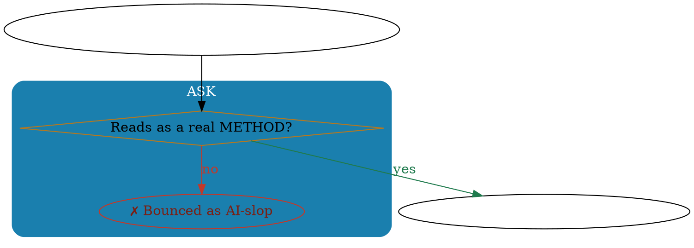

# dataviz/renderers/flow-graphviz — LLM-authored, Graphviz-laid-out flow diagrams

> **The split that makes flow diagrams look pro:** **LAYOUT** is the hard problem code
> can't hand-roll → give it to **Graphviz `dot`** (the gold-standard DAG/flowchart
> engine). **DRAWING** — the graph structure, the right sub-variety, the labels, the
> styling — is what **you (Claude Code) are great at** → you author the DOT. Result:
> "Claude Code draws it + exports the file," robustly.

## When to use this (vs svg-native)

Use **flow-graphviz** when the message is a **process/flow/decision/dependency** shape:
flowchart · workflow · process map · decision tree · swimlane / lane diagram · user-flow ·
journey-flow · org chart · dependency / pipeline graph · state diagram · directed network.

Use **svg-native** (the pure-Node renderer, via `gen.cjs`) for the statistical families
(bar/line/scatter/stacked/funnel/…). svg-native's `flowchart` remains the **deterministic
fallback** for headless/CRON callers that have no LLM to author DOT.

## Two authoring paths

### A) `--dot` — you author the DOT (PREFERRED, richest)
You write a `digraph { … }` and pass it. The renderer injects a brand theme **preamble**
(graph/node/edge defaults) — so anything you leave unstyled still lands on-brand, and
anything you DO style wins (Graphviz: per-element attrs override the injected defaults).

```
# write the DOT to a temp file, then:
node scripts/dataviz/flow-render.cjs --dot=/tmp/flow.dot --out=.archives/dataviz/<slug>/ --format=svg [--style=ritsu] [--rankdir=LR]
# (or pipe: cat /tmp/flow.dot | node scripts/dataviz/flow-render.cjs --dot=- --format=png > out.png is NOT how it works — use --out)
```

### B) `--spec` — a structured JSON (deterministic; for headless/programmatic/tests)
A non-LLM caller (or a test) passes `{nodes, edges, clusters, rankdir}`; the renderer
deterministically builds themed DOT. Node `role` → shape+color (see the vocabulary below).

```
node scripts/dataviz/flow-render.cjs --spec=/tmp/flow.json --out=.archives/dataviz/<slug>/ --format=png
```
Spec shape: `{"rankdir":"TB","title":"…","clusters":[{"id","label","color"}],"nodes":[{"id","label","role","cluster"}],"edges":[{"from","to","label","style":"solid|dashed","color":"default|red|amber|green|highlight|muted"}]}`

## The brand flow vocabulary (use these — they match the McKinsey/Ritsu reports)

| Element | Graphviz | Color | Use for |
|---|---|---|---|
| **start / end** | `shape=box style="rounded,filled" fillcolor="#222222" fontcolor=white` | ink | entry / exit |
| **step** | `shape=box style="rounded,filled" fillcolor=white color="#9AA6B2"` | white/grey border | a normal action |
| **decision / gate** | `shape=diamond style=filled fillcolor="#FCEBD2" color="#B5781F"` | amber | a yes/no branch, a bet |
| **moment / key** | `shape=box style="rounded,filled" fillcolor="#005EB8" fontcolor=white` | brand blue | the make-or-break step |
| **success / paid** | `shape=box style="rounded,filled" fillcolor="#E4F3E9" color="#1F7A4D" fontcolor="#0B3D26"` | green | the win |
| **risk / drop / fail** | `shape=box style="rounded,filled" fillcolor="#FBEAE7" color="#C0392B" fontcolor="#7A1F14"` | red | a drop-off / kill |
| **data / store** | `shape=cylinder` | white | a datastore |
| **io** | `shape=parallelogram` | white | input/output |
| **edge** | `color="#5E6B75"` (muted); `color="#C0392B"` red / `#1F7A4D` green / `#B5781F` amber | — | flow; label `yes`/`no`/conditions; `style=dashed` for loops/optional |
| **swimlane / phase** | `subgraph cluster_X { label="…"; style="filled,rounded"; color="<phase>"; fontcolor=white; …nodes… }` | phase color | group steps by stage/owner |

(When `--style=<brand>` is passed, the brand palette overrides the blue/grey/ink; the
semantic amber/green/red stay — they encode meaning, not brand.)

## Authoring craft (how to make it read pro)

- **Pick `rankdir`:** `TB` (top→down) for a vertical decision/user-flow; `LR` (left→right)
  for a wide linear process or pipeline.
- **One idea per node; short labels.** Use `\n` for a second line; keep nodes ≤ ~7 words.
- **Decisions are diamonds**, with **labeled out-edges** (`yes`/`no`, the condition).
- **Swimlanes = clusters.** Group by stage (a 5A journey), owner (org swimlane), or phase.
  Give each cluster a label + a distinct fill; put white text via `fontcolor=white`.
- **Use color to mean something:** red = drop/kill, green = happy-path/win, amber =
  the bet / a loop, blue = the key moment. Don't decorate.
- **Loops** (e.g. a referral flywheel) = a `style=dashed` back-edge with a short label.
- Keep it to one screen; if it sprawls, raise the abstraction (collapse sub-steps).

## Output

Writes `<slug>.{svg|png|pdf}` + the editable `<slug>.dot` + `run.json` to `--out` (or
`.archives/dataviz/<date>-<slug>/`). `--format`: `svg` (default, crisp+small), `png`
(embed in PDFs/decks), `pdf` (standalone). `--dry-run` prints the plan + the DOT, no render.

## Graceful degradation

`dot` not installed → the renderer **saves the `.dot`** and tells you to `brew install
graphviz` / `apt-get install graphviz` (or paste into GraphvizOnline). The diagram is
never lost. (For a guaranteed-no-engine caller, svg-native `flowchart` is the fallback.)

## Worked examples

**1) A decision/user-flow with swimlanes (TB) — author DOT directly:**

→ `node scripts/dataviz/flow-render.cjs --dot=/tmp/f.dot --out=.archives/dataviz/journey/ --format=png`

**2) A wide linear process (LR):** `--rankdir=LR`; steps as rounded boxes, one decision diamond, a labeled reject edge to a red node.

**3) An org / dependency graph:** plain `digraph`, `rankdir=TB`, boxes, no clusters — let `dot` lay out the hierarchy.

## Composition

- **`/think mckinsey` Sell + `reasoning-trace`:** any flow-family exhibit (issue tree,
  process map, decision flow, the user-flow) renders through THIS renderer → inherits the
  upgrade automatically (route the exhibit as a flowchart/workflow type).
- **`/dataviz` direct + `/deepask` flow format:** same — flow-family → flow-graphviz.
- **`--style=<brand>`** composes (brand palette overrides blue/grey/ink; semantics stay).

## Anti-claims

- NOT a statistical chart renderer — those stay svg-native (don't force bar/line through here).
- NOT a pixel-perfect hand-layout tool — Graphviz owns layout; you own structure + style.
- Not byte-stable across Graphviz versions (layout coords shift) — so it is NOT snapshot-tested;
  the `specToDot` DOT-builder IS pure + unit-tested, the `dot` render is smoke-tested (skip-if-absent).

## References
- Renderer: `scripts/dataviz/flow-render.cjs` · Registry: `knowledge/dataviz-renderers.yaml` (id `flow-graphviz`).
- Contract: `06-ai-ops/sops/SOP-AIOPS-011-dataviz-runtime-contract/`. Umbrella: `06-ai-ops/skills/dataviz/SKILL.md`.
