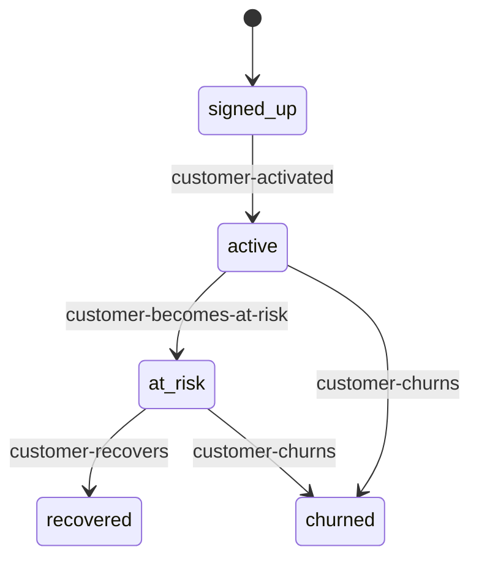

{/* generated-by: playbook-import v1.0.0 */}

> *"ops.tasks có state machine (Bài #5). ops.sop_runs có state machine (Bài #9). ops.events có routing_status (Bài #11). Nhưng customer? content piece? lead? compliance review? — Phase A không có chuẩn cho domain state."*

## 21.1 Tình huống

Founder TH7 anchor: *"Customer health score, lead lifecycle, content publish state, compliance review state — không có schema rõ ràng. Mỗi pillar tự define → drift."*

5 concrete domain state scenarios:

1. **Customer lifecycle** — signed_up → active → at_risk → recovered/churned
2. **Content piece** — idea → draft → in_review → approved/rejected → scheduled → published → archived
3. **Lead** — cold → warm → engaged → qualified → customer/lost
4. **Compliance review** — submitted → triage → investigating → decision_pending → resolved/escalated (DMCA 24h SLA)
5. **Subscription billing** — trial → active → past_due → cancelled → reactivated

**Founder expected:** every domain entity với non-trivial lifecycle has explicit state machine — declarative, runtime enforcement, transition events, audit trail.

**Khi sai:**
- Drift: `customers.status` vs `content.state` vs `leads.lifecycle` — naming chaos
- Lost transitions: ad-hoc UPDATE bypasses SOPs
- No audit: "when did customer X churn?" — unanswerable
- No SLA tracking: DMCA stuck in "Investigating" 5 days

## 21.2 Walk through Phase A + prior walkthroughs

### Have (operational state machines)

After 5 walkthroughs, **EVERY operational table has state**:
- ops.tasks (Bài #5)
- ops.agent_runs (Bài #5)
- ops.hitl_runs (Bài #2)
- ops.scheduled_runs (Bài #8)
- ops.sop_runs (Bài #9)
- ops.alerts (Bài #10)
- ops.events (Bài #11)
- ops.minion_jobs (Bài #5 + GBrain)
- ops.mcp_calls (Bài #12)

**Pattern: ops layer = state machines everywhere.** Ad-hoc per table.

### Don't have (DOMAIN state convention)

Phase A defers domain modeling: *"Domain entities defined per pillar in Phase B."*

**Phase A.2 reveals defer is wrong abstraction.** Domain state machines = cross-cutting architectural concern, not per-pillar.

14 gaps revealed (G3.1-G3.14): schema convention, transition rules, event emission, audit, SLA, dashboard, versioning, cross-domain transition, state-based SOPs, visualization, guards, migration, access control, retention.

## 21.3 Workaround vs proper extension

### Workaround
- Z1: Per-pillar custom state column — drift inevitable
- Z2: 3rd-party FSM (XState, Temporal) — lock-in, not Postgres-native
- Z3: Postgres-native + Tier 1 declarative — aligns với declarative-first pattern

**Recommendation: Z3 (proper).**

### Proper extension — Bài #13

4 axes:

#### Axis 1 — Schema Convention

**Standardized columns:**

```sql
CREATE TABLE customers (
  id              uuid PRIMARY KEY DEFAULT gen_random_uuid(),
  email           text NOT NULL UNIQUE,
  
  -- Bài #13 standard
  state           text NOT NULL,
  state_since     timestamptz NOT NULL DEFAULT now(),
  state_payload   jsonb,
  state_version   text NOT NULL,
  
  CONSTRAINT customers_state_valid CHECK (
    state IN ('signed_up', 'active', 'at_risk', 'churned', 'recovered')
  )
);

CREATE INDEX ON customers (state, state_since);

-- Sidecar audit
CREATE TABLE customers_state_log (
  id              uuid PRIMARY KEY DEFAULT gen_random_uuid(),
  customer_id     uuid NOT NULL REFERENCES customers(id),
  from_state      text,
  to_state        text NOT NULL,
  transition_id   text NOT NULL,
  triggered_by    text NOT NULL,         -- 'event' | 'manual' | 'sop' | 'sql_migration'
  triggered_by_id text,
  reason          text,
  changed_at      timestamptz NOT NULL DEFAULT now(),
  changed_payload_diff jsonb
);
```

**Pattern: 4 columns + sidecar.** Every domain entity follows.

**Trigger guard prevents bypass:**

```sql
CREATE OR REPLACE FUNCTION enforce_customer_state_transition()
RETURNS TRIGGER AS $$
BEGIN
  IF OLD.state IS DISTINCT FROM NEW.state THEN
    IF current_setting('app.via_state_transition', true) IS NULL THEN
      RAISE EXCEPTION 'Direct state change forbidden. Use state-transition skill.';
    END IF;
  END IF;
  RETURN NEW;
END;
$$ LANGUAGE plpgsql;
```

#### Axis 2 — Declarative Registry

```yaml
# knowledge/state-machines.yaml
domains:
  customer:
    table: customers
    initial_state: signed_up
    states:
      - name: signed_up
        sla:
          to_state: active
          deadline: 7 days
          alert_on_breach: customer-stuck-in-signup
      - name: at_risk
        sla:
          to_state: [active, recovered, churned]
          deadline: 30 days
      - name: churned
        retention:
          archive_after: 90 days  # GDPR
    
    transitions:
      - id: customer-becomes-at-risk
        from: active
        to: at_risk
        guard: "no login event in 14 days"
        triggered_by:
          - event: ritsu.customer.inactive_14d
        emits:
          - event: ritsu.customer.at_risk
        sop_triggers:
          - SOP-CUSTOMER-003-churn-intervention
      
      - id: customer-churns
        from: [active, at_risk]
        to: churned
        triggered_by:
          - event: stripe.subscription.canceled
          - event: ritsu.customer.inactive_90d
        emits:
          - event: ritsu.customer.churned
        sop_triggers:
          - SOP-CUSTOMER-004-exit-survey
          - SOP-CUSTOMER-005-win-back

  content_piece:
    # ...
  lead:
    # ...
  compliance_review:
    # ...
  subscription:
    # ...
```

**Properties:** declarative, SLAs, retention, transitions với guards/triggers/emits/sop_triggers, versioned, cross-references events + SOPs.

#### Axis 3 — Runtime Engine

**`state-transition` skill flow:**

```
Transition request (event-dispatcher / SOP step / skill call)
  ↓
1. Load state machine definition
2. Validate from_state matches current
3. Evaluate guard expression
4. If guard fails → reject với reason
5. BEGIN transaction:
   a. UPDATE row: state, state_since, state_payload
   b. INSERT into <table>_state_log
   c. Emit transition event (outbox pattern Bài #11)
6. COMMIT
7. SOPs trigger via Bài #11 dispatcher
```

**Skill marked deterministic** → ops.minion_jobs queue (GBrain Minions pattern).

#### Axis 4 — Observability + Migration

**Dashboard pages per domain (Bài #10):**
- `/business/customers/state` — distribution, time-in-state, transition velocity
- `/business/content/state` — content pipeline funnel
- `/business/leads/funnel` — conversion rates per channel
- `/operations/compliance/state` — backlog với SLA breaches
- `/business/subscriptions/state` — subscription health

**Visualization:**

```bash
ritsu-cli state-machine diagram customer
```

Outputs Mermaid → committed to `wiki/state-machines/customer.mmd`:



**Migration support:**

```yaml
# knowledge/state-machine-migrations/customer-v1.1.0.yaml
domain: customer
from_version: "1.0.0"
to_version: "1.1.0"
changes:
  - kind: add_state
    state: { name: trialing, description: ... }
  - kind: split_transition
    old_id: customer-activated
    new_transitions: [...]
bulk_migration_query: |
  UPDATE customers SET state = 'trialing', state_version = '1.1.0' ...
```

`ritsu-cli state-machine migrate customer 1.1.0` — Tier C HITL gate, dry-run preview, rollback.

**SLA breach auto-alerts:** SLAs in state-machines.yaml auto-generate alert-rules.yaml entries.

## 21.4 New components (20)

20 components: schema convention + Tier 1 declarative + runtime + visualization + migration + 3 cross-bài-toán updates (#9, #10, #11).

## 21.5 Bài #13 candidate

**Bài #13 — Domain State Machine Architecture**

**Question core:** Every domain entity với non-trivial lifecycle has explicit declarative state machine — runtime enforcement, transition events, audit trail, SLA tracking, dashboard, migration support.

**Dependencies:** Bài #1, #2, #5, #9 DRAFT, #10 DRAFT, #11 DRAFT

## 21.6 Lessons captured

1. **State machine = cross-cutting, not per-pillar.** Phase A defer wrong.
2. **4 columns + sidecar = no drift.**
3. **Trigger guard = defense in depth.**
4. **Versioning from day 1.**
5. **Transitions emit events naturally.**
6. **Transitions trigger SOPs naturally.**
7. **SLA per state = breach alerts free.**
8. **Mermaid as living docs.**
9. **Cross-domain atomic = v1.x defer.**
10. **state_payload jsonb = sub-state, controlled by machine.**

## 21.7 Open questions

| ID | Question | Resolve when |
|---|---|---|
| OQ13.1 | Hierarchical/parallel states? | Need surfaces |
| OQ13.2 | Cross-domain atomic transitions? | v1.x |
| OQ13.3 | ML-detected state inference? | After 6 months |
| OQ13.4 | State-based RLS? | Operator joins |
| OQ13.5 | Legacy data evolution? | First migration |
| OQ13.6 | B2B vs B2C variants? | B2B segment grows |

## 21.8 Anti-patterns

- ❌ Per-pillar custom state column
- ❌ Direct SQL UPDATE bypass
- ❌ State machine in code, not declarative
- ❌ No versioning
- ❌ Transition without audit
- ❌ Change without event emission
- ❌ No SLA per state
- ❌ Shared state names across domains (each domain = own machine)
- ❌ Skip diagram visualization
- ❌ Mutate state_payload outside machine

## 21.9 Cross-references

- **Bài #5:** ops.tasks already has state machine — Bài #13 formalizes pattern
- **Bài #2:** Migrations require Tier C HITL
- **Bài #9:** sop_triggers in transition definition; SOP step calls state-transition skill
- **Bài #10:** Per-domain dashboard pages, SLA breach auto-alerts
- **Bài #11:** Outbox pattern emits transition events; events trigger transitions
- **Bài #12:** Auto-generated MCP tools (`ritsu.<domain>.transition_state`, `ritsu.<domain>.state_log`)
- **GBrain Knowledge Graph (G15 future):** Transitions as typed edges; "all customers churned in Q1"
- **GBrain Minions:** state-transition deterministic → minion queue; bulk migrations parallel

## 21.10 Tổng kết

- **Bài #13 candidate: Domain State Machine Architecture**
- **4 axes:** schema convention / declarative registry / runtime engine / observability+migration
- **20 new components**
- **Pattern formalization:** ops layer state machines (Phase A + A.2 walkthroughs) → cross-cutting standard
- **Cross-bài-toán integration:** events (Bài #11), SOPs (Bài #9), dashboard (Bài #10), MCP (Bài #12)

**Pattern after 6 walkthroughs:** declarative-first architecture với 8 Tier 1 files (schedules, kpi-registry, alert-rules, event-subscriptions, event-aggregation, mcp-tools, mcp-roles, **state-machines**) = operational DNA.

Sang chương sau — walkthrough G15 Knowledge Graph (NEW from GBrain).

---

**Tham khảo:**
- High-altitude pass: G3 entry (score 6.55)
- Walkthrough note: `_build/notes/phase-a2/walkthroughs/G3-state-machines.md`
- DRAFT architecture: `knowledge/phase-a2-extensions/bai-13-domain-state-machines-DRAFT.md`
- Phase A dependencies: Chương 8 (Bài #5 ops.tasks)
- Phase A.2 dependencies: Chương 16 (Bài #9 SOP), Chương 17 (Bài #10 Visibility), Chương 19 (Bài #11 Events), Chương 20 (Bài #12 MCP)
